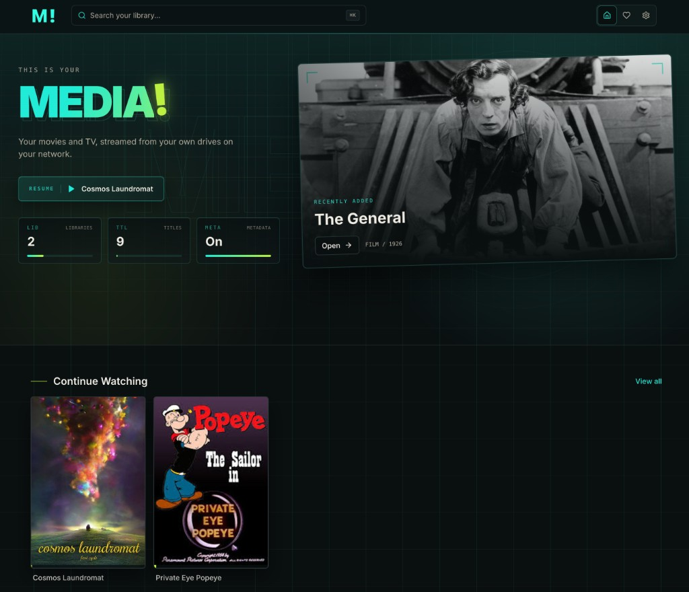

# MEDIA!

Self-hosted movies and TV. One Node app, SQLite, FFmpeg for transcoding.

**[github.com/gabenunez/media-app](https://github.com/gabenunez/media-app)**



## Install

**Docker (recommended)**

```yaml
# docker-compose.yml
services:
  media:
    image: ghcr.io/gabenunez/media-app:latest
    container_name: media
    restart: unless-stopped
    ports:
      - "8096:8096"
    volumes:
      - ./config:/config
      - ./data:/data
      - /path/to/movies:/media/movies:ro
      - /path/to/tv:/media/tv:ro
```

```bash
docker compose up -d
```

Open `http://localhost:8096`, then add libraries in **Settings** using the
container paths (e.g. `/media/movies`). Full guide: **[docs/docker.md](docs/docker.md)**.

**Linux VPS (no Docker)**

```bash
curl -fsSL https://raw.githubusercontent.com/gabenunez/media-app/main/install.sh | bash
```

Open `http://YOUR_SERVER:8096/settings` and add library folders.

**From source**

```bash
git clone https://github.com/gabenunez/media-app.git && cd media-app
pnpm install && pnpm build && pnpm start
```

Dev with hot reload: `./scripts/dev.sh`

**Update**

- **Docker:** `docker compose pull && docker compose up -d`
- **Other installs:** Settings → Updates in the app, or `./update.sh`

## Setup

1. Add movie/TV folders in **Settings**
2. Add a [TMDB API key](https://www.themoviedb.org/settings/api) (posters & metadata)
3. Scan libraries, then browse

## Integrations

MEDIA! connects to a few external services. All API keys are optional except TMDB if you want posters and metadata.

| Integration | What it does | Setup |
|-------------|--------------|-------|
| **[TMDB](https://www.themoviedb.org/)** | Posters, descriptions, cast, and library matching | **Settings → API keys** — free key at [themoviedb.org/settings/api](https://www.themoviedb.org/settings/api) |
| **[fanart.tv](https://fanart.tv/)** | TV show theme music on detail pages | **Settings → API keys** — free key at [fanart.tv/get-an-api-key](https://fanart.tv/get-an-api-key/) |
| **[ThemerrDB](https://app.lizardbyte.dev/ThemerrDB)** | Movie theme music (and TV fallback when fanart.tv has none) | Automatic via yt-dlp — no key needed |
| **[OpenSubtitles](https://www.opensubtitles.com/)** | Search and download subtitles during playback | **Settings → API keys** — free key at [opensubtitles.com/en/consumers](https://www.opensubtitles.com/en/consumers) |
| **Plex** | Import resume points and watched state from a local Plex library database | **Settings → Import from Plex** — reads `com.plexapp.plugins.library.db` on the server host |
| **Google Chromecast** | Cast from the web player to Chromecast devices | Built in — requires FFmpeg for formats Chromecast can't play directly |
| **Cast to TV** | Send playback from a phone/browser to the Android TV app on the same LAN | Use the cast button on the watch page when a TV receiver is online |
| **GitHub** | In-app update checks and one-click upgrades | Automatic — uses git tags and `CHANGELOG.md` from [github.com/gabenunez/media-app](https://github.com/gabenunez/media-app) |

**Also built in:** FFmpeg transcoding (HLS remux/transcode), embedded subtitle tracks, local `theme.mp3` files in media folders, and TV-mode web UI for browsers and the Android TV shell.

## Android TV app

The Android TV client is a thin shell that connects to your MEDIA! server over the LAN and loads the web UI in TV mode.

**Requirements:** JDK 17+, Android SDK (Android Studio recommended).

```bash
pnpm android:build
```

APK output: `packages/android-tv/app/build/outputs/apk/debug/app-debug.apk`

**Sideload on Android TV**

1. Enable developer options and USB/network debugging on the TV (or use `adb connect TV_IP`).
2. Install: `adb install packages/android-tv/app/build/outputs/apk/debug/app-debug.apk`
3. Open **MEDIA!** from the Android TV launcher.
4. Enter your server address (e.g. `192.168.1.50` port `8096`).

The app validates the connection via `/api/status`, then opens your server at `/?tv=1` with D-pad-friendly navigation. Press **Menu** on the remote to change servers. Native **ExoPlayer** handles video behind the web UI; voice search is supported on Google TV / Android TV.

## License

MIT
